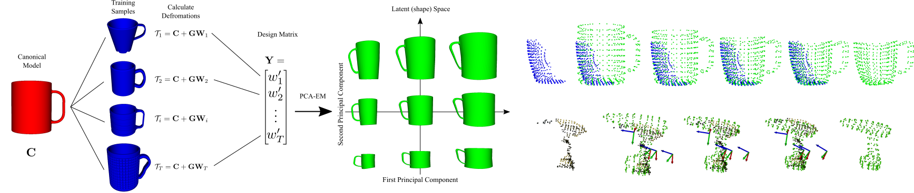
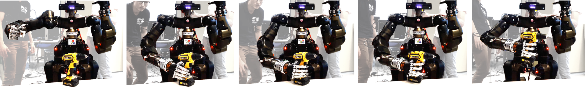

# Shape Registration  
Code accompanying the ICRA paper: "Transferring Grasping Skills to Novel Instances by Latent Space Non-Rigid Registration" [ [Paper](http://ais.uni-bonn.de/papers/ICRA_2018_Rodriguez.pdf)]

Project page: http://www.ais.uni-bonn.de/~rodriguez/#!/ShapeSpaceRegistration

This repository provides a tool for category-based, shape (latent) space, non-rigid registration.
- Starting with just a number of instances belonging to your category, this framework is able to
deform a choosen canonical instance into novel observed category instances.
- The inference can be performed from a single view of the object and thus is suitable for on-line applications.
- Generation of novel instances is also possible by interpolating and extrapolating between the training samples in the constructed shape space.
- Integration with ROS, so the observed model can be directly defined from a ROS topic.

The major contributors of this repository include [Diego Rodriguez](http://www.ais.uni-bonn.de/~rodriguez), Florian Huber and Corbin Cogswell.




## Citing Shape Registration
If you find Shape Registration useful in your research, please consider citing:
```
@INPROCEEDINGS{Rodriguez2018a,
title     = {Transferring Grasping Skills to Novel Instances by Latent Space Non-Rigid Registration},
author    = {D. Rodriguez and C. Cogswell and S. Koo and S. Behnke},
booktitle = {IEEE Int. Conf. on Robotics and Automation (ICRA)},
year      = {2018}
}
```
## Dependencies
- Eigen (http://www.eigen.tuxfamily.org/index.php?title=Main_Page)
- ROS Kinetic (Indigo, Lunar and Melodic should also be OK)
- PCL_ROS: `sudo apt install ros-kinetic-pcl-ros` (on Kinetic)
- CERES (http://ceres-solver.org/) `sudo apt install libceres-dev` 
- VTK: `sudo apt install libvtk6-dev` (libvtk5-dev on Trusty)
- Qwt: `sudo apt install libqwt-qt5-dev` (libqwt-dev on Trusty)

## Installation
1. Install dependencies:
```
$ sudo apt install ros-kinetic-pcl-ros libceres-dev libvtk6-dev libqwt-qt5-dev
```

2. Clone this repository in your ROS workspace
```
$ git clone https://github.com/AIS-Bonn/shape_registration.git
```

2. Built it! If you are using catkin tools: 
```
$ catkin build surface_registration
```

## Usage
Initially only point clouds are supported but very soon (seriously) a version that supports meshes will be released.

1. Prapare the dataset of your category as Point Cloud Data (.pcd).

2. Run the gui launch file:
    ``` 
    $ roslaunch shape_registration gui.launch
    ```

3. *Calculate deformation fields*:
    Create a new category by clicking on the "Create new category" button and load your models by pressing the "load instances" button, 
    Your instances should now be listed on the right side, the first and 
    second one are displayed as the canonical (red) and the observed (green) instances. 
    To calculate the deformation fields just click on "Calculate deformation fields". 
    Save your progress with the "Save category" button.

4. *Load a category*:
    Use the "Load category" button and select the folder named after the category you want to load. After this all your instances should appear, together with the results of the CPD.

5. *Find the Shape Space*:
    Change to "Testing". Select the dimension of the shape space, then press the "Calculate PCA"
    button. The object displayed in blue shows the inferred model. You could visualize the contribution of each dimesnion of the shape space by using the interactive plot.

6. *Infer shape parameters of novel instances*:
    Click on "Point Cloud File" or "Point Cloud Topic" to define an observed instance. 
    After clicking "Fit to Observed", the latent space vector that matches the observed instance at best is found." 

7. *Example Dataset*:
    The folder dataset contains 11 point clouds of drills meant for training a category and 3 testing instances.

## Misc.
Code has been tested under:
- Ubuntu 16.04, ROS Kinetic

## Stay tuned
Other works you might find interesting:
- Accumulating Grasping Skills.[[Paper](http://ais.uni-bonn.de/papers/RA-L_2018_Rodriguez.pdf)] [[Project page](http://www.ais.uni-bonn.de/~rodriguez/#!/AccumulateGraspingKnowledge)]
- Learning Grasping Synergies.[[Paper](http://www.ais.uni-bonn.de/~rodriguez/publications/humanoids_2018_learn_syn/humanoids_2018_Rodriguez.pdf)] [ [Project page](http://www.ais.uni-bonn.de/~rodriguez/#!/LearningSynergies)]
- Autonomous Dual-arm Manipulation[[Paper](http://www.ais.uni-bonn.de/~rodriguez/publications/humanoidsi_2018_bimanual/humanoids_2018_Pavlichenko.pdf)] [[Project page](http://www.ais.uni-bonn.de/~rodriguez/#!/BimanualManipulation)]
